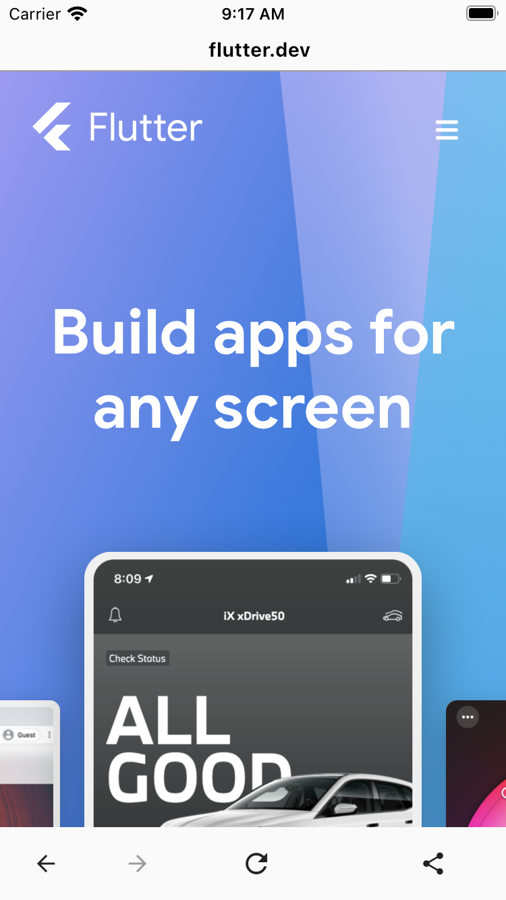

[](https://pub.dartlang.org/packages/web_browser)
[](https://github.com/dint-dev/web_browser/actions?query=workflow%3A%22Dart+CI%22)

# Overview
[Browser](https://pub.dev/documentation/web_browser/latest/web_browser/WebBrowser-class.html) is
a Flutter widget for browsing websites.
* Works in Android, iOS, and browsers. Various cross-platform differences are handled correctly by
  the package so you don't need to deal with details of
  [webview_flutter](https://pub.dev/packages/webview_flutter).
* Has a customizable top bar that displays URI. To protect end-users against phishing attacks, we
  show the domain clearly and nothing else.
* Has customizable bottom bar with buttons for "back", "forward", "refresh", and URL sharing.

Licensed under the [Apache License 2.0](LICENSE).

## Links
* [Github project](https://github.com/dint-dev/web_browser)
* [Issue tracker](https://github.com/dint-dev/web_browser/issues)
* [API Reference](https://pub.dev/documentation/web_browser/latest/index.html)

# Setting up
## 1.Setup
In _pubspec.yaml_:
```yaml
dependencies:
  web_browser: ^0.6.0
```

## 2.Display web browser
```dart
import 'package:flutter/material.dart';
import 'package:web_browser/web_browser.dart';

void main() {
  runApp(const MaterialApp(
    home: Scaffold(
      body: SafeArea(
        child: WebBrowser(
          initialUriString: 'https://flutter.dev/',
        ),
      ),
    ),
  ));
}
```

# Manual
## Designs available in this package
The package contains two designs:
* [web_browser.cupertino](https://pub.dev/documentation/web_browser/latest/web_browser.cupertino/web_browser.cupertino-library.html)
* [web_browser.material](https://pub.dev/documentation/web_browser/latest/web_browser.cupertino/web_browser.material-library.html)

By default, the package chooses a Cupertino or Material design based on whether the app is _CupertinoApp_ or _MaterialApp_.

|  |  |

## Localization
Use [BrowserLocalizations](https://pub.dev/documentation/web_browser/latest/web_browser/BrowserLocalizations-class.html) to localize the widgets.